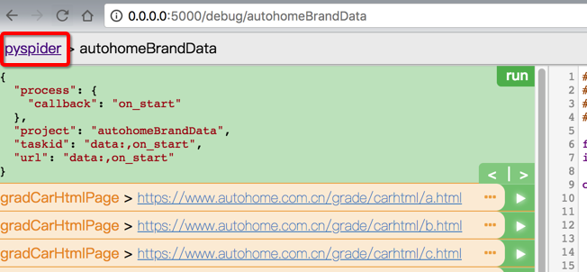
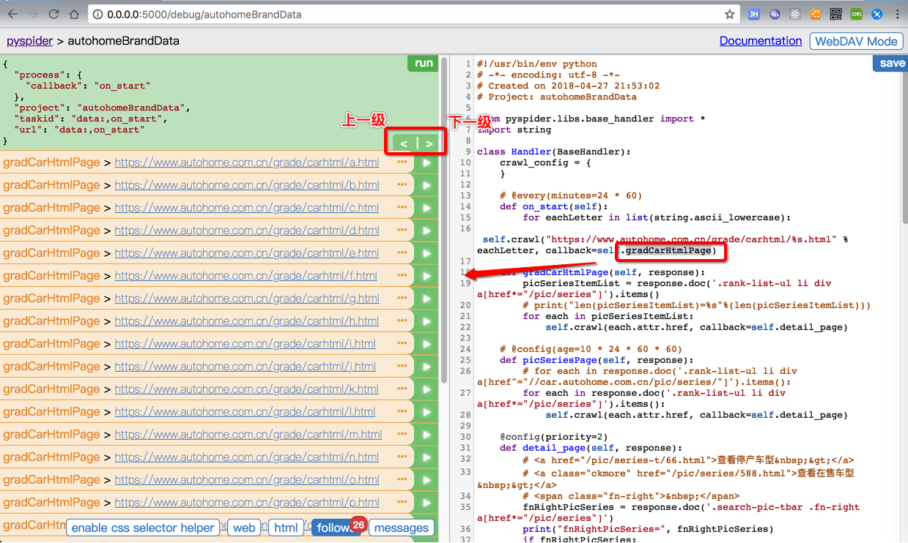
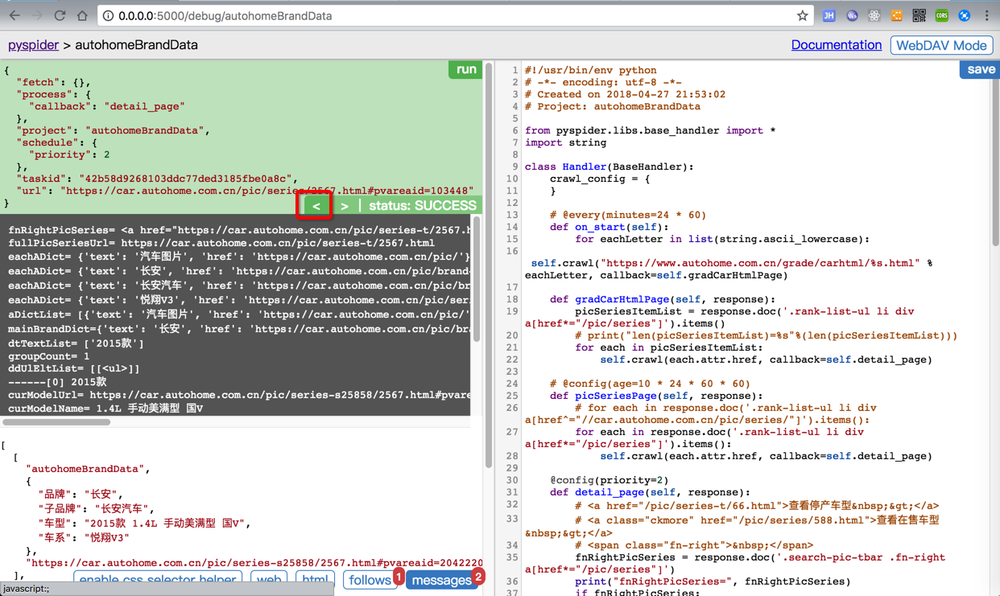
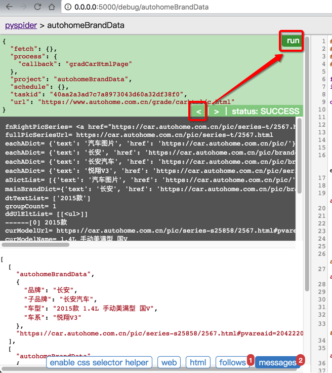
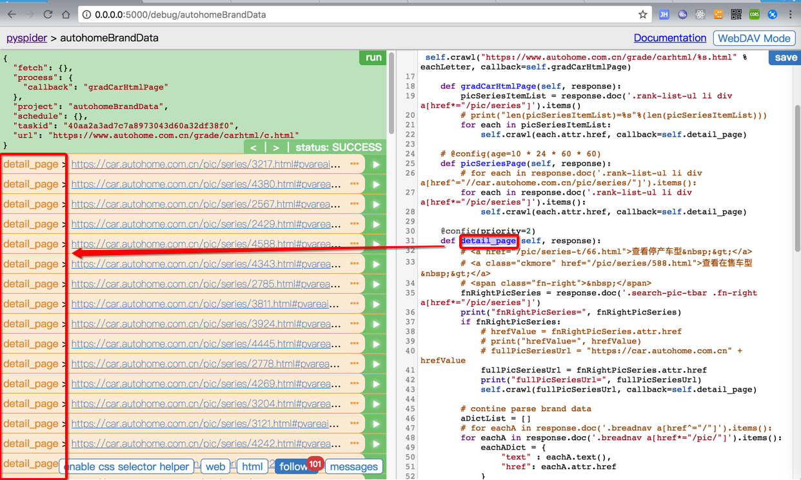
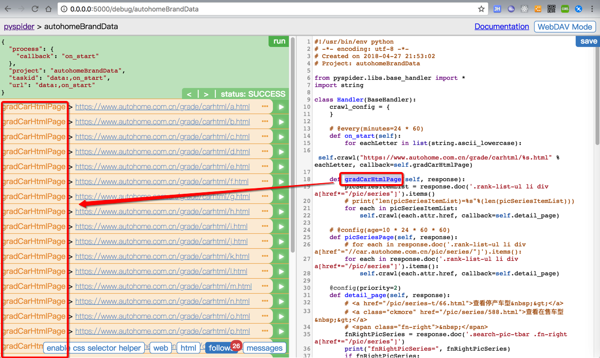

# PySpider基本用法

## 使用PySpider的基本步骤

下面来介绍一下PySpider的使用的步骤和操作：

### 运行PySpider

在某个目录下的终端命令行中输入`pyspider`即可启动运行。

注：

* 如果是用虚拟环境安装的PySpider，记得先进去虚拟环境后再运行PySpider
  * 比如用的`pipenv`，则是先`pipenv shell`，再`pyspider`
* `pyspider`等价于`pyspider all`

### 进入`WebUI`

然后去用浏览器打开：

http://0.0.0.0:5000/

即可进入爬虫的管理界面了，此界面一般称为：`WebUI`

### 新建爬虫项目

点击`Create`，去新建一个爬虫项目

输入:

* 爬虫名称：
* 入口地址：自动生成的代码中，会作为起始要抓取的url
  * 也可以不填
  * 后续也可以去代码中修改的

然后再点击新建的爬虫项目，进入调试页面

新建出来的项目，默认状态是`TODO`

点击新建出来的项目名，直接进入调试界面

然后右边是编写代码的区域

左边是调试的区域，用于执行代码，显示输出信息等用途

### 调试爬虫代码

编写代码，调试输出信息，保存代码

调试代码期间，对于想要返回上一级：

先说之前不熟悉的时候的操作：

之前调试运行时，不知道还有回到上一级，在想要返回上一级时，都直接是点击左上角的项目名字



返回项目列表：

![返回PySPider的项目列表]](../assets/img/return_pyspider_project_list.png)

然后重新进去，重新点击Run，直到跑到对应的层级，去继续调试。

再说后来知道了PySpider内置支持这种逻辑操作：

PySpider对在调试期间所需要在上一个连接和下一个连接之间切换的操作，支持的很好：

点击 `< | >` 的 `<` 或 `>`，则可以 `返回上一级` 或 `进入下一级`

实际效果演示：



想要返回上一级的爬取函数的话，点击 左箭头



然后再点击Run：



然后就可以返回上一级了。

然后也才注意到，每行的follow的左边开始显示的是：callback函数名

此处的是`detail_page`



而对应的上一级的结果中，也是上一级的callback：



### 运行爬虫去爬取数据

调试完毕后，返回项目，status改为DEBUG或RUNNING，点击Run

想要暂停运行：status改为STOP

### 保存已爬取的数据

当爬取完毕数据，需要保存下来时，可以有多种保存方式：

* mysql数据库
* MongoDB数据库
* CSV或Excel文件

#### 保存到csv或Excel文件

基本思路：确保自己代码中，最后return返回的字段是你要的字段

如何得到CSV文件：在任务运行期间或完毕后，去`Results`-》点击下载`CSV`，即可得到你要的csv格式的数据文件。

结果：PySpider会自动在已有字段中加上额外的`url`字段

> #### info:: 用VSCode编辑csv文件
> * 如果想要去除多余的不需要的`url`字段，则可以通过文本编辑器，比如`VSCode`去列编辑模式，批量删除，或者查找和替换，都可以实现
> * 最后会多余一列，标题是 …，内容全是`,{}`，所以直接用编辑器比如VCScode去替换为空以清空，即可

详见：

[【已解决】PySpider如何把json结果数据保存到csv或excel文件中 – 在路上](https://www.crifan.com/pyspider_save_json_result_data_to_csv_or_excel_file/)

> #### warning:: Excel去打开CSV文件结果乱码
> csv文件编码默认为UTF8（是好事，通用的），但是如果用（不论是Mac还是Win中的）excel去打开，结果（估计对于中文系统，都是）会默认以GKB（或GB18030）打开，所以会乱码
> 
> 解决办法：[【已解决】Mac或Win中用Excel打开UTF8编码的csv文件显示乱码](http://www.crifan.com/mac_win_use_excel_open_utf8_encoding_csv_file_show_messy_code)

## PySpider中选择html中的元素和内容

PySpider中的html的元素的选择，或者说`css选择器`，默认是用的`PyQuery`。

确切的说是：PySpider针对html的响应`response`，默认提供了一个`doc`属性，其内置了`PyQuery`解析后结果，所以你可以用`response.doc("your_css_selector")`去选择你要的html中的内容了。

而具体的your_css_selector的写法，则就变成`PyQuery`的写法了。

举例：

想要提取：

```html
<ul class="rank-list-ul" 0="">
  <li id="s3170">
...
    <div>
      ...
      <a id="atk_3170" href="//car.autohome.com.cn/pic/series/3170.html#pvareaid=103448">图库</a>
    ...
    </div>
  </li>
...
</ul>
```

中的href的值，则：

PyQuery的写法是：`.rank-list-ul li div a[href*="/pic/series"]`

PySpider的代码是：

```python
  for each in response.doc('.rank-list-ul li div a[href*="/pic/series"]').items():
```

详见： [【已解决】pyspider中如何写规则去提取网页内容 – 在路上](https://www.crifan.com/pyspider_how_write_rule_to_extract_html_webpage_content/)

### PyQuery

`response.doc`返回后的`PyQuery对象`，之后可以继续用PyQuery去操作

此处列出PyQuery的一些典型的操作函数：

* `PyQuery.filter(selector)`
* `PyQuery.find(selector)`
* `PyQuery.items(selector=None)`
* `PyQuery.siblings(selector=None)`

另外，常见的一些属性来说：

* `PyQuery.text(value=<NoDefault>)`：当前节点的text文本值
* `PyQuery.html(value=<NoDefault>, **kwargs)`：当前节点的html值

另外：

* 关于css操作可以参考：[CSS — pyquery 1.2.4 documentation](https://pythonhosted.org/pyquery/css.html)

关于PyQuery，详见另外教程：

【整理Book】Python心得：PyQuery
